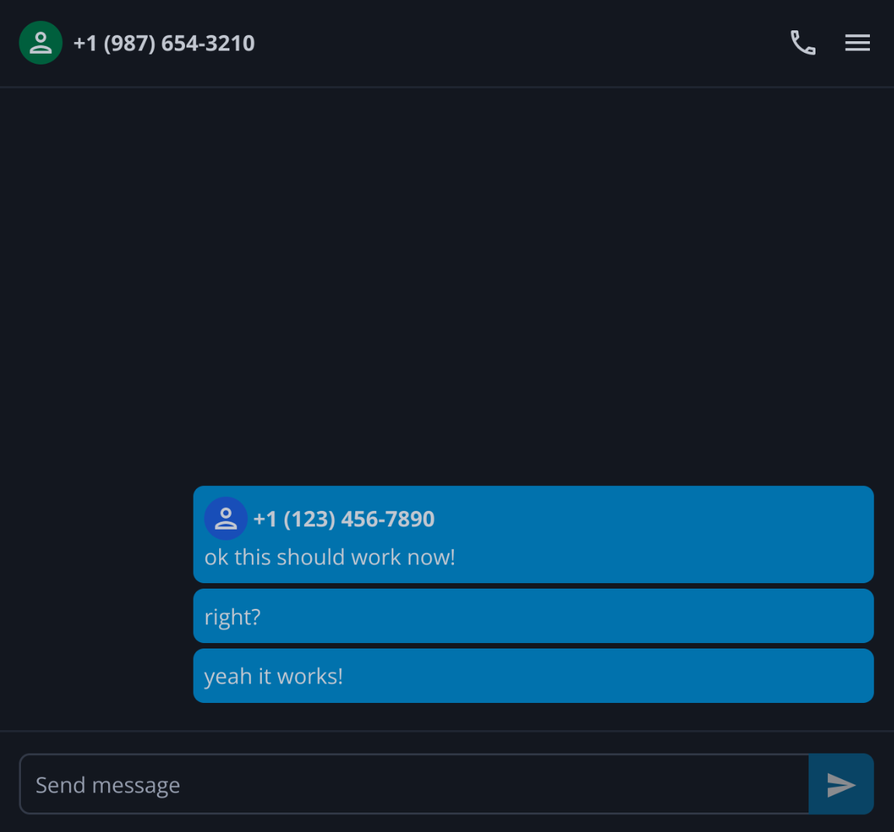

# fakesms

<div align="center">
  
</div>

Fake SMS app in [Svelte][svelte] using [the wsbridge-client protocol][wsbridge].
It serves as a hassle-free way to demonstrate Twipi's capabilities.

## Running

You need [Nix][nix] with Flakes enabled. First, enter the Nix shell:

```sh
nix develop
```

Then, generate all the needed files and run the app using [Task][task]:

```sh
task
```

[wsbridge]: https://github.com/twipi/twipi/blob/main/proto/wsbridge.proto
[svelte]: https://svelte.dev/
[nix]: https://nixos.org/
[task]: https://taskfile.dev/
